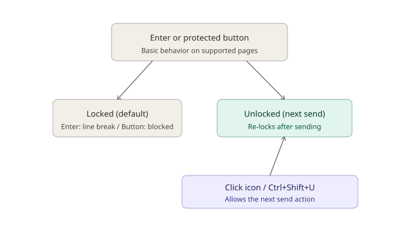

<p align="center">
  
</p>

# Enterlude

 

English | [日本語](./README.md) | [한국어](./README.ko.md) | [繁體中文](./README.zh-TW.md)

A Chrome/Edge extension that prevents accidental sends in AI chats (Claude / ChatGPT / Gemini) — no more half-written messages sent by a stray Enter key or misclick.

## Screenshots

| Locked | Unlocked |
|---|---|
|  |  |

## Status

✅ [Available on the Chrome Web Store (v1.4.3, updated August 7, 2026)](https://chromewebstore.google.com/detail/enterlude-ai%E8%AA%A4%E9%80%81%E4%BF%A1%E9%98%B2%E6%AD%A2/efefkammkfpoccefhmeeifidffackpkm)
— [source code available on GitHub](https://github.com/Maximiliana65/enterlude)

**Supported services**
- Claude
- ChatGPT
- Gemini

**Supported browsers**
- Google Chrome
- Microsoft Edge (Chromium-based)

**Tested environment**
- OS: Windows 11 Home
- Browser: Google Chrome / Microsoft Edge (both regular and private/incognito windows)

Other OSes and environments have not been tested by the developer.

See [ROADMAP.md](./ROADMAP.md) for what's planned, [CHANGELOG.md](./CHANGELOG.md) for release history, [DEVLOG.md](./DEVLOG.md) for the development journal, [docs/ARCHITECTURE.md](./docs/ARCHITECTURE.md) for the current architecture and maintenance guide (Japanese), [docs/DESIGN.md](./docs/DESIGN.md) for the original design notes, and [docs/privacy.en.md](./docs/privacy.en.md) for the privacy policy.

## What it does



- While locked, **Enter inserts a line break instead of sending your message**
- When you actually want to send, click the 🔒 badge in the corner (or press `Ctrl+Shift+U`) to unlock
  - The unlock is good for **exactly one send**, then it automatically re-locks
  - Press `Esc` to cancel the unlock without sending
- Send and "Regenerate/Retry" buttons that Enterlude recognizes as protected on supported services are protected. When a service shows an additional-choice menu, explicitly selecting its final option can proceed
- (Optional) A small, playful comment can appear after each send — off by default

To open the settings, click the browser toolbar's Extensions (puzzle-piece) icon and select Enterlude. You can turn playful comments on or off and choose their language in the settings.

## Installation (developer mode)

**Chrome**
1. Download and unzip this folder
2. Open `chrome://extensions`
3. Turn on "Developer mode" (top right)
4. Click "Load unpacked" and select this folder
5. Open `https://claude.ai` — if you see the lock badge in the bottom right, you're set

**Edge**
Same steps, but at `edge://extensions`. Edge is Chromium-based, so it works the same way.

## Folder structure

```
core/       … shared lock logic, independent of any specific site
            … *-page-guard.js files run in the page's own MAIN world
              (ChatGPT and Gemini only — see DEVLOG for why)
adapters/   … per-site definitions of "where's the input box / send button"
fun/        … the optional fun-comment feature (comments.ja.js / comments.en.js /
              comments.ko.js / comments.zh-TW.js, picked automatically based on the browser's UI language,
              or overridden manually from the settings screen)
popup/      … the settings screen opened from the toolbar icon
_locales/   … UI strings for i18n (currently Japanese, English, Korean, and Traditional Chinese)
icons/      … toolbar icon (the teal Enterlude brand mark, designed for small sizes)
docs/       … design notes, screenshots, brand assets
```

To add support for another AI service, first add a site-specific file under `adapters/` and register the site in `manifest.json`. If the site's event handling competes with the extension, it may also need dedicated selectors and a MAIN-world guard. See the [architecture guide](./docs/ARCHITECTURE.md) (Japanese) for details.

## Versioning

This project follows [Semantic Versioning](https://semver.org/) (`MAJOR.MINOR.PATCH`). Future public releases are tagged on a tested release commit (for example, `v1.4.3`).

<details>
<summary>Maintainer notes: safe release workflow</summary>

- New backward-compatible feature → bump MINOR (e.g. `0.1.0` → `0.2.0`)
- Bug fix only → bump PATCH (e.g. `0.2.0` → `0.2.1`)
- Breaking change → bump MAJOR
- Work follows: working branch → required verification → pull request → review → squash merge → final browser verification on `main` → tag. Do not push directly to `main`
- Tag only the verified release commit on `main`. Do not recreate missing historical tags by guessing

Push only the tag for the release:

```
git push origin v1.4.3
```

</details>

## Supported / Not supported

**Supported**
- Claude (Web / claude.ai)
- ChatGPT (Web / chatgpt.com)
- Gemini (Web / the main gemini.google.com page)

**Not currently supported**
- Enterlude works on the regular web page of each service (claude.ai / chatgpt.com /
  gemini.google.com). Browser-specific side panels or built-in AI screens (e.g. Chrome's
  "Gemini side panel" or Microsoft Edge's "Copilot") are native browser features that work
  differently under the hood from a regular web page, so they are not supported.

## Limitations

- This extension is an **assistive tool** to help reduce accidental sends. It cannot guarantee prevention in every situation.
- Changes to the user interface of the supported AI services (Claude / ChatGPT / Gemini) may temporarily affect compatibility until the extension is updated.
- Please review important messages before sending.
- This software is provided "AS IS" under the [MIT License](./LICENSE), without warranty of any kind.

## License

[MIT License](./LICENSE) — free to modify, redistribute, and use commercially. Just keep the copyright notice.
