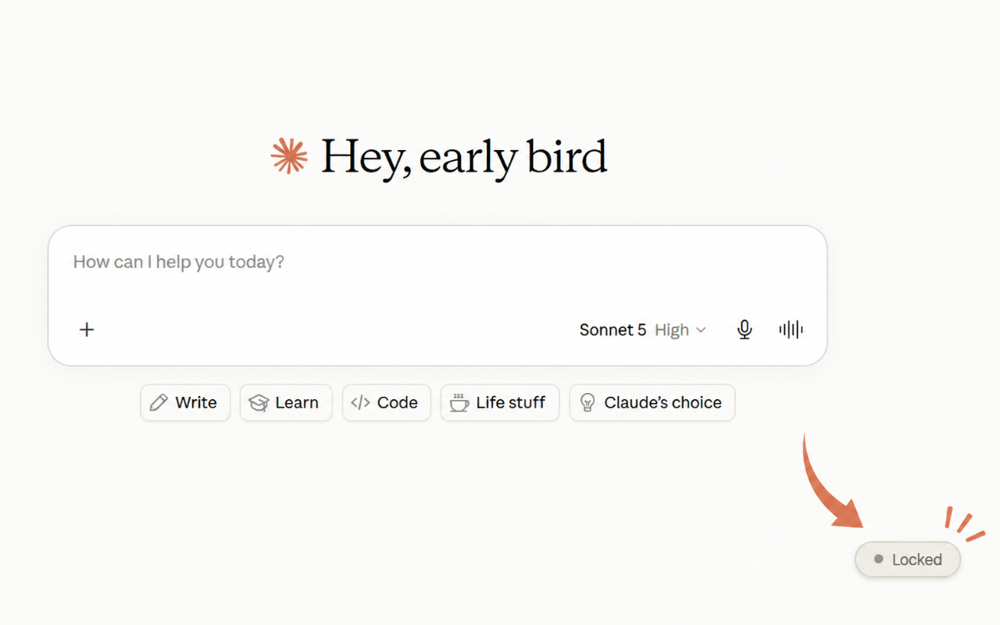
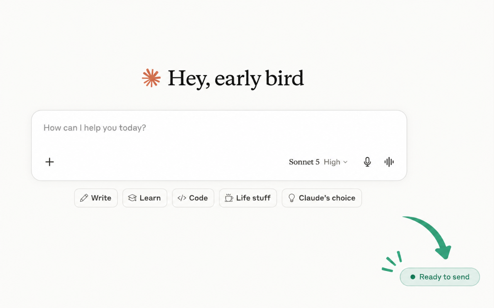
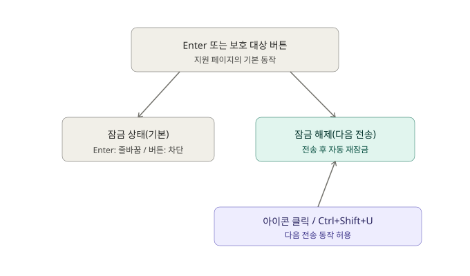

<p align="center">
  
</p>

# Enterlude

 

한국어 | [日本語](./README.md) | [English](./README.en.md) | [繁體中文](./README.zh-TW.md)

AI 채팅(Claude / ChatGPT / Gemini)에서 실수로 Enter나 전송 버튼을 눌러, 작성 중이던 메시지가 그대로 전송되는 사고를 막아주는 Chrome/Edge 확장 프로그램입니다.

## 스크린샷

| 잠금 상태 | 잠금 해제 상태 |
|---|---|
|  |  |

## 현재 상태

✅ 공개됨 — [GitHub에서 공개 중](https://github.com/Maximiliana65/enterlude) (Claude / ChatGPT / Gemini, Chrome·Edge의 일반/시크릿 모드에서 동작 확인 완료)

향후 계획은 [ROADMAP.md](./ROADMAP.md), 변경 이력은 [CHANGELOG.md](./CHANGELOG.md), 개발 과정은 [DEVLOG.md](./DEVLOG.md), 초기 설계 내용은 [docs/DESIGN.md](./docs/DESIGN.md), 개인정보처리방침은 [docs/privacy.ko.md](./docs/privacy.ko.md)를 참고해 주세요.

## 기능



- **Enter 키는 항상 줄바꿈**으로 동작하여, 실수로 메시지가 전송되지 않습니다
- 실제로 전송하고 싶을 때만, 모서리의 🔒 배지를 클릭하거나 `Ctrl+Shift+U`를 눌러 잠금을 해제합니다
  - 잠금 해제는 **정확히 1회 전송**에만 유효하며, 이후 자동으로 다시 잠깁니다
  - `Esc` 키를 누르면 전송하지 않고 잠금 해제를 취소할 수 있습니다
- 전송 버튼과 "다시 생성/재시도" 버튼도 동일하게 보호됩니다
- (선택 사항) 전송 후 짧은 코멘트가 표시되는 재미 기능도 있습니다 (기본값은 꺼짐)

## 설치 방법 (개발자 모드)

**Chrome**
1. 이 폴더를 다운로드하고 압축을 풉니다
2. `chrome://extensions`를 엽니다
3. 오른쪽 상단의 "개발자 모드"를 켭니다
4. "압축해제된 확장 프로그램을 로드합니다"를 클릭하고 이 폴더를 선택합니다
5. `https://claude.ai`를 열어, 오른쪽 하단에 잠금 배지가 보이면 준비 완료입니다

**Edge**
같은 방법으로 `edge://extensions`에서 진행하면 됩니다. Edge도 Chromium 기반이라 동일하게 동작합니다.

## 폴더 구조

```
core/       … 사이트에 의존하지 않는 공통 잠금 로직
            … *-page-guard.js 파일은 페이지 본체와 같은 MAIN world에서 실행됨
              (ChatGPT・Gemini 전용, 자세한 이유는 DEVLOG 참고)
adapters/   … 사이트별 "입력창・전송 버튼 위치" 정의
fun/        … 선택적인 재미 코멘트 기능 (comments.ja.js / comments.en.js / comments.ko.js를
              브라우저 표시 언어에 따라 자동으로 선택. 설정 화면에서 수동 지정도 가능)
popup/      … 툴바 아이콘에서 여는 설정 화면
_locales/   … 다국어 지원용 UI 문구 (현재 일본어・영어・한국어)
icons/      … 툴바 아이콘 (작은 크기에서도 잘 보이도록 단순한 자물쇠 모양 채택)
docs/       … 설계 자료, 스크린샷, 브랜드 에셋
```

다른 AI 서비스를 지원하려면 `adapters/`에 새 파일 하나를 추가하고 `manifest.json`에 사이트를 등록하는 것만으로 충분하도록 설계되어 있습니다.

## 버전 관리

이 프로젝트는 [시맨틱 버저닝](https://semver.org/)(`MAJOR.MINOR.PATCH`)을 따르며, 릴리스마다 Git 태그(예: `v0.7.0`)를 붙입니다.

<details>
<summary>유지보수자용 메모: 태그 운영 방법</summary>

- 하위 호환되는 새 기능 추가 → MINOR 증가 (예: `0.1.0` → `0.2.0`)
- 버그 수정만 있는 경우 → PATCH 증가 (예: `0.2.0` → `0.2.1`)
- 사용 방식이 바뀌는 큰 변경 → MAJOR 증가
- 각 릴리스마다 Git 태그를 붙임

GitHub에 태그를 반영하려면:

```
git push origin main --tags
```

</details>

## 지원 범위

**지원**
- Claude (웹 / claude.ai)
- ChatGPT (웹 / chatgpt.com)
- Gemini (웹 / gemini.google.com 메인 화면)

**현재 미지원**
- Chrome에 내장된 "Gemini 사이드 패널" 기능 — 일반적인 웹페이지가 아니라 Chrome
  브라우저 자체의 네이티브 기능으로 보이며, 동작 방식이 근본적으로 다르기 때문에
  현재는 지원하지 않습니다.

## 제한 사항

- 이 확장 프로그램은 오발송을 줄이기 위한 **보조 도구**입니다. 모든 상황에서 오발송을 완전히 방지하는 것을 보장하지는 않습니다.
- 지원 대상 AI 서비스(Claude / ChatGPT / Gemini)의 화면이 업데이트되면, 일시적으로 정상 동작하지 않을 수 있습니다.
- 중요한 내용을 전송하기 전에는 다시 한 번 확인해 주세요.
- 본 소프트웨어는 [MIT 라이선스](./LICENSE)에 따라 "있는 그대로(AS IS)" 제공되며, 어떠한 보증도 하지 않습니다.

## 라이선스

[MIT 라이선스](./LICENSE) — 수정・재배포・상업적 이용 모두 자유롭습니다. 저작권 표시만 남겨주세요.
