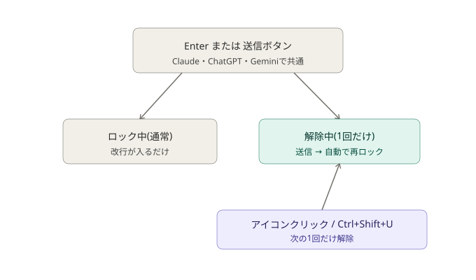

<p align="center">
  
</p>

# Enterlude

 

**日本語** | [English](./README.en.md) | [한국어](./README.ko.md) | [繁體中文](./README.zh-TW.md)

AIチャット(Claude / ChatGPT / Gemini)で、うっかりEnterキーや送信・再試行ボタンを
押してしまい、書きかけのメッセージを送ってしまう事故を防ぐためのChrome/Edge拡張機能です。

## スクリーンショット

| ロック中 | ロック解除中 |
|---|---|
|  |  |

## 現在のステータス

✅ [Chrome ウェブストアで公開中（v1.4.3、2026-08-07更新）](https://chromewebstore.google.com/detail/enterlude-ai%E8%AA%A4%E9%80%81%E4%BF%A1%E9%98%B2%E6%AD%A2/efefkammkfpoccefhmeeifidffackpkm)
— [ソースコードはGitHubで公開中](https://github.com/Maximiliana65/enterlude)

**対応サービス**
- Claude
- ChatGPT
- Gemini

**対応ブラウザ**
- Google Chrome
- Microsoft Edge（Chromiumベース）

**動作確認環境**
- OS: Windows 11 Home
- ブラウザ: Google Chrome / Microsoft Edge（通常モード・シークレットモードとも確認済み）

※上記以外のOS・環境では、開発者による動作確認は行っていません。

対応予定は [ROADMAP.md](./ROADMAP.md) を、変更履歴は [CHANGELOG.md](./CHANGELOG.md) を、
開発の過程は [DEVLOG.md](./DEVLOG.md) を、現在の実装と保守方針は [docs/ARCHITECTURE.md](./docs/ARCHITECTURE.md) を、
初期設計の記録は [docs/DESIGN.md](./docs/DESIGN.md) を、プライバシーポリシーは [docs/privacy.md](./docs/privacy.md) をご覧ください。

## できること



- ロック中は**Enterキーでは送信されず、改行のみになります**
- 送信したい時だけ、右下の🔒アイコンをクリック（またはショートカット `Ctrl+Shift+U`）でロックを解除
  - 解除は**次の1回だけ**有効。送信すると自動的にまたロックがかかります
  - `Esc` キーでロック解除をキャンセルできます
- 対応サイトで保護対象として認識した送信・再試行ボタンの誤クリックをブロックします。サービス側の追加選択メニューは、最終項目を明示して選ぶと実行できます
- （任意）送信後に一言コメントを表示する、ちょっとしたお楽しみ機能つき（初期状態はOFF）

## インストール方法（開発者モード）

**Chromeの場合**
1. このフォルダをダウンロード・展開する
2. Chromeで `chrome://extensions` を開く
3. 右上の「デベロッパーモード」をONにする
4. 「パッケージ化されていない拡張機能を読み込む」をクリックし、このフォルダを選択する
5. `https://claude.ai` を開いて、右下にロックアイコンが表示されていれば準備完了です

**Edgeの場合**
上と同じ手順を `edge://extensions` で行ってください。Edge(Chromiumベース)でも同じように動作します。

## フォルダ構成

```
core/       … 送信ロックの共通ロジック（サイトに依存しない部分）
            … *-page-guard.js は、サイト本体と同じ実行空間(MAIN world)で
              動く専用ガード(ChatGPT・Geminiのみ。詳細はDEVLOG参照)
adapters/   … サイトごとの「入力欄・送信ボタンの場所」の定義
fun/        … お楽しみ機能（一言コメントなど。comments.ja.js / comments.en.js / comments.ko.js /
              comments.zh-TW.jsを
              ブラウザの表示言語に応じて自動的に切り替え。設定画面から手動指定も可能）
popup/      … 拡張機能アイコンから開く設定画面
_locales/   … 多言語対応のための表示文言（現在: 日本語・英語・韓国語・繁体字中国語）
icons/      … 拡張機能アイコン（ツールバー表示用。視認性重視のシンプルな鍵デザイン）
docs/       … 設計資料・スクリーンショット・ブランド用ロゴなど
```

新しいAIサービスに対応させる際は、まず`adapters/`にサイト用のファイルを追加し、`manifest.json`に対象サイトを登録します。サイト側のイベント処理と競合する場合は、専用のセレクタとMAIN worldガードも必要です。詳しくは[アーキテクチャ](./docs/ARCHITECTURE.md)を参照してください。

## バージョン管理について

このプロジェクトは [セマンティックバージョニング](https://semver.org/lang/ja/)（`MAJOR.MINOR.PATCH`）でバージョンを管理しています。今後の正式公開では、動作確認済みの公開コミットにGitタグ（例: `v1.4.3`）を付与します。

<details>
<summary>メンテナー向けメモ: 安全なリリース手順</summary>

- 新機能を追加したら MINOR を上げる（例: `0.1.0` → `0.2.0`）
- バグ修正だけなら PATCH を上げる（例: `0.2.0` → `0.2.1`）
- 使い方が変わるような大きな変更をしたら MAJOR を上げる
- 作業は `main` から作業ブランチを作り、必要な動作確認をしてからPull Requestを作成します。内容を確認してSquash mergeし、`main`上でも最終実機確認を行います。`main`へ直接pushはしません
- 公開する`main`の確認済みコミットにだけタグを付けます。過去の不足タグを推測で追加しません

GitHubにタグを反映するには、対象のタグだけをpushします。

```
git push origin v1.4.3
```

</details>

## 対応範囲

**対応**
- Claude (Web / claude.ai)
- ChatGPT (Web / chatgpt.com)
- Gemini (Web / gemini.google.com のメイン画面)

**現在非対応**
- 対応対象は、各サービスの通常のWebページ（claude.ai / chatgpt.com / gemini.google.com）です。
  ブラウザ独自のサイドパネルや組み込みAI画面（例: Chromeの「Geminiサイドパネル」、Microsoft Edgeの
  「Copilot」）は、通常のWebページとは仕組みが異なるブラウザのネイティブ機能のため、対応していません。

## Limitations（制限事項）

- この拡張機能は、誤送信を減らすための**補助ツール**です。すべての状況で誤送信を完全に防止することを保証するものではありません
- 対応しているAIサービス（Claude / ChatGPT / Gemini）側の画面が更新されると、一時的に正しく動作しなくなる場合があります
- 重要な内容を送信する前は、あらためて内容をご確認ください
- 本ソフトウェアは[MITライセンス](./LICENSE)のもと、現状有姿（"AS IS"）で提供されます

## ライセンス

[MIT License](./LICENSE) — 改造・再配布・商用利用も自由です。著作権表示は残してください。
