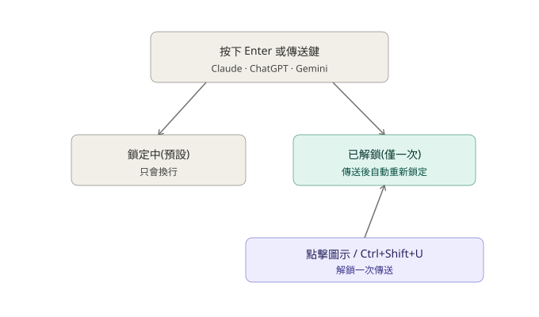

<p align="center">
  
</p>

# Enterlude

 

繁體中文 | [日本語](./README.md) | [English](./README.en.md) | [한국어](./README.ko.md)

Enterlude 是一款 Chrome/Edge 擴充功能，可防止您在 AI 聊天（Claude / ChatGPT / Gemini）中，因不小心按下 Enter 鍵或傳送按鈕，而誤傳尚未寫完的訊息。

## 螢幕截圖

| 鎖定中 | 已解鎖 |
|---|---|
|  |  |

## 目前狀態

✅ 已發布 — [GitHub 上線中](https://github.com/Maximiliana65/enterlude)

**支援服務**
- Claude
- ChatGPT
- Gemini

**支援瀏覽器**
- Google Chrome
- Microsoft Edge(Chromium 核心)

**測試環境**
- OS：Windows 11 Home
- 瀏覽器：Google Chrome / Microsoft Edge(一般模式與隱私模式皆已確認)

※上述以外的OS・環境，開發者尚未進行測試確認。

規劃內容請參考 [ROADMAP.md](./ROADMAP.md)，變更紀錄請參考 [CHANGELOG.md](./CHANGELOG.md)，開發過程請參考 [DEVLOG.md](./DEVLOG.md)，原始設計文件請參考 [docs/DESIGN.md](./docs/DESIGN.md)，隱私權政策請參考 [docs/privacy.zh-TW.md](./docs/privacy.zh-TW.md)。

## 功能



- **Enter 鍵永遠只會換行** — 訊息不會被意外送出
- 想要傳送時，只要點擊角落的 🔒 徽章（或按下 `Ctrl+Shift+U`）即可解鎖
  - 解鎖後**僅能傳送一次**，之後會自動重新鎖定
  - 按下 `Esc` 可以取消解鎖、不進行傳送
- 一般的傳送鈕與「重新產生／重試」鈕的誤觸會受到保護。若服務顯示需要額外選擇的選單，明確選取最終項目即可執行
- （選用）每次傳送後，可以顯示一句俏皮的小提示 — 預設關閉

## 安裝方式（開發者模式）

**Chrome**
1. 下載並解壓縮此資料夾
2. 開啟 `chrome://extensions`
3. 開啟右上角的「開發人員模式」
4. 點選「載入未封裝項目」，選擇此資料夾
5. 開啟 `https://claude.ai`，如果右下角出現鎖定徽章，就代表設定完成

**Edge**
步驟相同，改在 `edge://extensions` 進行。Edge 同樣基於 Chromium，運作方式一致。

## 資料夾結構

```
core/       … 與特定網站無關的共用鎖定邏輯
            … *-page-guard.js 會在網頁本身的 MAIN world 中執行
              (僅限 ChatGPT 與 Gemini — 詳見 DEVLOG)
adapters/   … 各網站「輸入框／傳送按鈕在哪裡」的定義
fun/        … 選用的趣味留言功能（comments.ja.js / comments.en.js /
              comments.ko.js / comments.zh-TW.js 會依瀏覽器顯示語言自動選擇，
              也可以在設定畫面手動指定）
popup/      … 從工具列圖示開啟的設定畫面
_locales/   … 多語系UI文字（目前有日文、英文、韓文、繁體中文）
icons/      … 工具列圖示（簡單的鎖頭造型，在小尺寸下依然清晰）
docs/       … 設計文件、截圖、品牌素材
```

要支援其他AI服務，只需要在 `adapters/` 新增一個檔案，並在 `manifest.json` 中加入該網站即可。

## 版本管理

本專案採用[語意化版本](https://semver.org/)（`MAJOR.MINOR.PATCH`）。未來正式發布時，會在完成動作確認的發布提交上加上 Git 標籤（例如 `v1.4.3`）。

<details>
<summary>維護者備忘：安全的發布流程</summary>

- 新增向下相容的功能 → 提升 MINOR（例如 `0.1.0` → `0.2.0`）
- 僅修正錯誤 → 提升 PATCH（例如 `0.2.0` → `0.2.1`）
- 重大變更 → 提升 MAJOR
- 依照「工作分支 → 必要的動作確認 → Pull Request → 內容確認 → Squash merge → 在 `main` 上進行最終瀏覽器驗證 → 標籤」的順序進行。不要直接推送到 `main`
- 只在已確認要公開的 `main` 提交上加上標籤，不要以猜測方式補建過去缺少的標籤

只將本次發布的標籤推送到 GitHub：

```
git push origin v1.4.3
```

</details>

## 支援範圍

**支援**
- Claude（網頁版／claude.ai）
- ChatGPT（網頁版／chatgpt.com）
- Gemini（網頁版／gemini.google.com 主畫面）

**目前不支援**
- 支援對象是各服務的一般網頁(claude.ai / chatgpt.com / gemini.google.com)。瀏覽器自身的
  側邊欄或內建 AI 畫面(例如 Chrome 的「Gemini 側邊欄」、Microsoft Edge 的「Copilot」)，
  由於是與一般網頁運作方式根本不同的瀏覽器原生功能，因此不支援。

## 限制事項

- 本擴充功能是用來**輔助減少誤傳**的工具，無法保證在所有情況下都能完全防止誤傳。
- 當支援的 AI 服務（Claude / ChatGPT / Gemini）更新畫面時，可能會暫時影響相容性，直到擴充功能更新為止。
- 傳送重要內容前，請務必再次確認。
- 本軟體依 [MIT 授權條款](./LICENSE) 以「現狀」提供，不含任何保證。

## 授權

[MIT 授權條款](./LICENSE) — 歡迎自由修改、再散布、商業使用，僅需保留著作權聲明。
