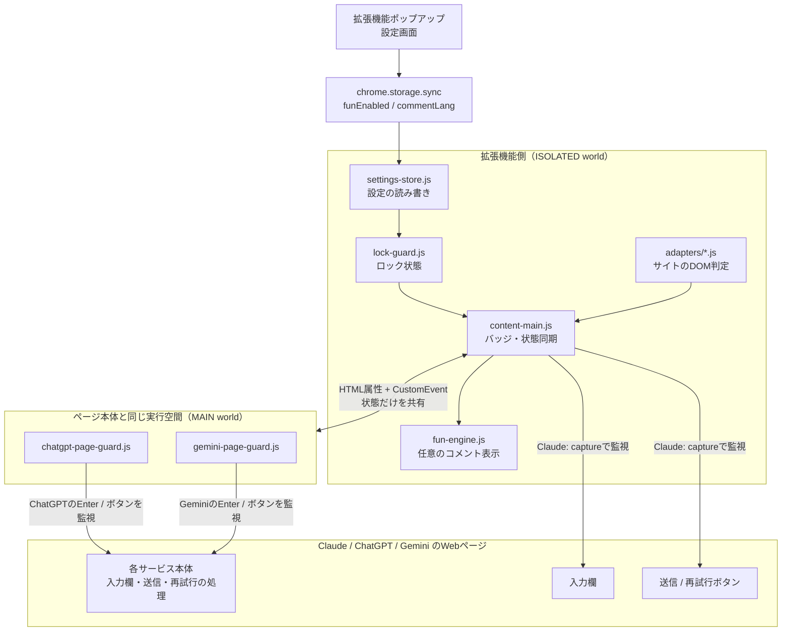
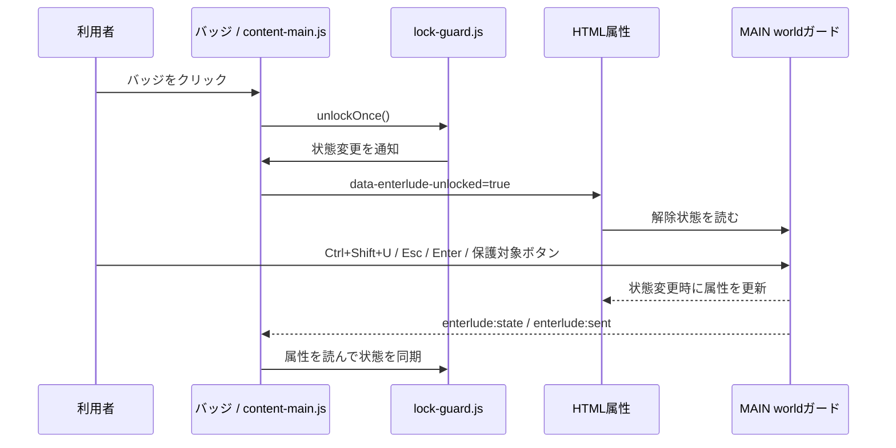
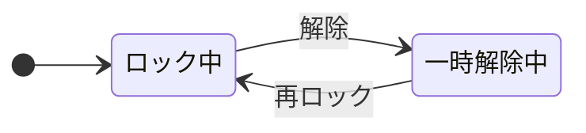

# Enterlude アーキテクチャ

> 対象バージョン: v1.4.3
>
> 最終確認: 2026-08-09

Enterludeは、Claude / ChatGPT / Geminiの通常のWebページで、書きかけのメッセージを誤って送らないようにするChrome / Edge拡張機能です。この文書は、後から開発に参加する人やAIが、**どのファイルが何を担当し、なぜ一見重複に見える安全策が残っているのか**を理解するための設計記録です。

コードを整理・置換・削除する前には、必ずこの文書、[DEVLOG](../DEVLOG.md)、Git履歴と実機動作を確認してください。Enterludeでは、送信を先回りして止めるタイミングが機能の中心であり、見た目だけでは理由を判断できない処理があります。

## 目次

1. [全体像](#全体像)
2. [起動と担当の分け方](#起動と担当の分け方)
3. [ロック状態と一時解除](#ロック状態と一時解除)
4. [入力・ボタンの扱い](#入力ボタンの扱い)
5. [MAIN worldを使う理由](#main-worldを使う理由)
6. [IMEと改行](#imeと改行)
7. [意図的に残している安全策](#意図的に残している安全策)
8. [新しいサイトを追加する場合](#新しいサイトを追加する場合)
9. [変更時の確認事項](#変更時の確認事項)
10. [設計に影響した主な履歴](#設計に影響した主な履歴)

## 全体像

Enterludeには常駐するバックグラウンド処理はありません。対応するAIチャットのページを開いたときに、`manifest.json`で指定したスクリプトが`document_start`（ページのJavaScriptが本格的に動く前）に読み込まれます。

### ファイルごとの役割

| 場所 | 役割 | 変更時の注意 |
|---|---|---|
| `manifest.json` | 対象URL、読み込み順、MAIN / ISOLATED world、`document_start`を定義 | 読み込み順・world・実行時期は誤送信防止のタイミングに直結する |
| `core/lock-guard.js` | ロック・一時解除・再ロックの状態だけを持つ | 送信判定や画面表示をここへ混ぜない |
| `core/content-main.js` | 右下バッジ、Claudeのイベント監視、ChatGPT / Geminiとの状態同期、コメント表示 | MAIN world採用サイトのイベントを二重に処理しない |
| `adapters/claude.js` | Claudeの入力欄・送信・再試行ボタンを判定 | サイト画面変更時はまずここを実機調査する |
| `core/*-selectors.js` | 通常の読み込み時に使うChatGPT / Geminiの対象セレクタの正本 | MAIN / ISOLATEDの両方で使うため、変更は両方の動作確認が必要。各ガード・アダプターの予備定義も照合する |
| `core/*-page-guard.js` | ChatGPT / Geminiでページ本体より先にイベントを止める | 過去の競合修正そのもの。理由なくISOLATED worldへ戻さない |
| `adapters/chatgpt.js`, `adapters/gemini.js` | サイト識別と、将来ISOLATED worldのみへ戻す場合の判定窓口 | 現在の主な判定はMAIN world側だが、不要と判断して削除しない |
| `core/settings-store.js`, `popup/` | お楽しみコメントのON / OFFと言語設定 | 設定は`chrome.storage.sync`に保存する |
| `fun/` | コメント本文と言語選択、表示演出 | 誤送信防止の成否とは独立した任意機能 |

## 起動と担当の分け方

### Claude

Claudeは、拡張機能側の`content-main.js`が`window`の**capture phase**で、Enter・クリックを監視します。`adapters/claude.js`は「今操作された要素が入力欄／送信／再試行か」だけを判定し、共通処理がロック状態に応じて通過・遮断を決めます。

### ChatGPTとGemini

ChatGPTとGeminiでは、Enter・保護対象ボタンの監視と、ショートカット／Escによる状態変更を`MAIN world`の専用ガードへ分離しています。右下バッジ、コメント設定、ロック状態の表示は、引き続き拡張機能側の`content-main.js`が担当します。

MAIN worldと拡張機能側はJavaScriptの変数を直接共有できません。そのため、共有するのは`<html>`の`data-enterlude-unlocked`属性（解除中かどうかだけ）と、`enterlude:state` / `enterlude:sent`イベントです。メッセージ本文や会話内容は共有・保存しません。

## ロック状態と一時解除

`core/lock-guard.js`は、送信できるかどうかを`unlocked`という1つの状態で管理します。ページを開くと常にロック状態から始まります。

| 状態 | 操作 | 結果 |
|---|---|---|
| ロック中 | Enter | 送信を止め、改行として扱う |
| ロック中 | 保護対象として認識した送信・再試行ボタン | 操作を止める（対象範囲はサイトごとに異なる） |
| 一時解除中 | Enterまたは保護対象ボタン | 1回だけサイト本来の処理を通す |
| 一時解除中 | Escまたはバッジ再クリック | 送信せずロックへ戻る |
| 保護対象の操作後 | 次の操作 | サイトごとのタイミングで再びロック中として扱う |

「一時解除」は拡張機能全体をOFFにする設定ではありません。次の意図した1操作だけを通すための状態です。

## 入力・ボタンの扱い

各サービスの画面構造とイベントの順番が違うため、完全に同じ処理にはしていません。

| サービス | ロック中のEnter | 解除中のEnter | 送信・再試行ボタン | 特有の理由 |
|---|---|---|---|---|
| Claude | capture phaseで止め、`insertText`で改行 | 通過させ、直後に再ロック | `click`をcapture phaseで止める／通す | 通常の拡張機能側の先回りで安定して動く |
| ChatGPT | MAIN worldで止め、サイト本来の`Shift+Enter`処理を発火して改行 | 通過させ、直後に再ロック | 既知セレクタに一致するボタンだけを対象にする。現在確認した再試行の追加メニューは対象外 | ProseMirrorへ文字列改行を直接入れると空白扱いになることがある |
| Gemini | MAIN worldで止め、改行を挿入 | 入力欄が空になったことを確認してから再ロック | `pointerdown`・`mousedown`・`click`、Enter / Spaceを監視 | ボタン処理がclickより前に始まり、入力欄が動的に作り直されることがある |

### 再ロックのタイミング

- **Claude**: 解除中のEnterまたは保護対象ボタンを通すと、その操作を1回分としてすぐに再ロックします。Claudeの再試行は単一の操作であり、お楽しみ機能をONにしている場合は、解除して実行したときにコメントも表示されます。
- **ChatGPT**: ロック中のEnterは、ChatGPT本体が対応している改行処理へ置き換えます。解除中のEnterはページ側へ通した後、入力欄が実際に空になった場合だけ送信成立として再ロックし、お楽しみコメントを表示します。公式設定が「Enterで改行」の場合は解除状態を消費せず、改行だけで終わった場合もコメントを表示しません。現行画面で確認した再試行ボタンと追加メニューは、MAIN worldガードの保護対象として検出されず、ロック中でも操作できます。コードには再試行用の候補セレクタがありますが、現在の画面構造には一致していないためです。
- **GeminiのEnter**: 解除中Enterでは、現行の入力欄が空になったことを`MutationObserver`で検出したとき、送信開始とみなして再ロックします。5秒以内に空欄を検出できなければ、解除状態を保ち、Escなどで通常どおり戻せます。
- **Geminiの送信・再試行ボタン**: 解除中に保護対象ボタンのクリックを通した時点で、1回分として再ロックします。再試行で追加メニューが開く場合は、この時点で`enterlude:sent`イベントが発生するため、お楽しみ機能をONにしているとコメントはメニュー表示時に出ます。追加メニューの最終項目は、現在確認した画面では保護対象として検出されず、実行時にはコメントも表示されません。

Geminiの最後の挙動は、お楽しみコメントの表示タイミングとしては改善候補です。ただし、ロックの安全性とは別の任意機能であり、送信・再試行の保護を壊さないことを優先して、v1.4.3では変更しない判断にしています。

## MAIN worldを使う理由

Chrome拡張機能の通常のcontent scriptは、ページのJavaScriptとは別の実行空間（ISOLATED world）で動きます。ChatGPTでは、この世界で登録したEnter監視がページ側の送信処理より後になり、ロック中でも送信される競合が発生しました。

そのため、ChatGPTとGeminiだけは、`manifest.json`で`world: "MAIN"`を指定し、`document_start`からページ本体と同じ実行空間でcapture phase監視を始めています。これはページの処理を早く止めるための意図的な選択です。

MAIN worldはページ側の変更の影響を受けやすいという交換条件があります。そこで、対象を送信防止に必要な小さなガードへ限定し、設定・バッジ・コメントなどは従来どおり拡張機能側に残しています。

## IMEと改行

日本語・韓国語などのIME変換を確定するためのEnterは、送信の意思ではありません。入力欄でのEnterガードは次の場合、何もせずサイト本来の処理に任せます。

- `event.isComposing`が`true`
- `event.keyCode === 229`
- 入力欄での`Shift+Enter`（各サービスが元々持つ改行操作）

特にChatGPTは、ロック中の改行を独自の文字列挿入で済ませず、ChatGPT自身が対応している`Shift+Enter`相当のイベントを発火します。これにより、ProseMirror上で改行が空白文字になる過去の不具合を避けます。

## 意図的に残している安全策

次の処理は、一見すると重複や冗長に見えますが、過去の回帰を避けるために残しています。

| 安全策 | 理由 | 変更時に必要な確認 |
|---|---|---|
| `chatgpt-selectors.js` / `gemini-selectors.js` | 通常の読み込み時にMAIN worldとISOLATED worldで参照するセレクタを集める | 3サービスの入力・送信・再試行が正しく対象になること |
| ガード・アダプター内の予備セレクタ定義 | MAIN worldでセレクタ読み込みが間に合わないと、分割代入の例外でガード全体が停止したため | ページ直後の読み込み、再読み込み、通常／プライベートモード。正本と予備定義の両方を照合する |
| `window.__enterlude...Installed` | SPAの画面遷移などで同じガードを二重登録しない | 画面遷移後に二重反応しないこと |
| `data-enterlude-unlocked`とCustomEvent | MAIN / ISOLATED間で状態だけを同期し、二重処理を避ける | バッジ、ショートカット、Esc、送信後の表示が一致すること |
| Geminiの`pointerdown` / `mousedown`遮断 | clickだけでは再試行が始まってしまう実例があった | マウス、タッチ相当、Enter、Spaceでのボタン操作 |
| Geminiの`MutationObserver` | 入力欄の置換だけでは送信成功と断定できない | 解除後の送信、送信失敗、空欄、IME入力 |
| `safeCall`と設定の既定値 | 拡張機能更新後に古いタブで起きる`Extension context invalidated`で全体が止まらないようにする | 更新後の既存タブでバッジ・表示が壊れて見えないこと |

Claudeの入力欄・ボタン判定や、ChatGPT / Geminiの`aria-label`を含むセレクタには、画面変更への対応のための予備候補があります。対象を狭められそうに見えても、削除前にはGit履歴と実際の通常画面・追加メニューでの挙動を確認してください。

## 新しいサイトを追加する場合

新しいAIチャットを追加するときは、既存のセレクタを急いで共通化せず、そのサイトを独立したアダプターとして調査します。

1. 通常のWebページで、入力欄・送信ボタン・再試行ボタンの実際のDOMを確認する
2. Enter、Shift+Enter、IME確定、クリック、Enter / Spaceでのボタン操作が、どのイベント・どの順番で処理されるかを実機で調べる
3. ISOLATED worldのcapture phaseで確実に先回りできるなら、`adapters/<site>.js`を追加し、`content-main.js`の共通処理を使う
4. ページ側との競合がある場合だけ、`core/<site>-selectors.js`と`core/<site>-page-guard.js`を追加してMAIN worldを採用する
5. `manifest.json`に対象URL・スクリプトの読み込み順・必要なら`world: "MAIN"`を追加する
6. ロック、解除、Esc、Enter、Shift+Enter、IME、送信、再試行、追加選択メニュー、通常／プライベートモードを確認する
7. 変更理由と実機結果をDEVLOGへ記録し、Pull Requestで確認してから統合する

MAIN worldは便利な共通テンプレートではなく、サイト側のイベント競合が確認されたときだけ採用する例外です。

## 変更時の確認事項

送信防止に関わる変更では、少なくとも次を対象サイトごとに確認します。

- ロック中のEnterが本当の改行になること
- Shift+Enterが元どおり改行できること
- `Ctrl+Shift+U`と右下バッジで1回だけ解除できること
- Escで送信せず解除を取り消せること
- 日本語IMEの確定が妨げられないこと
- サイトごとの保護対象ボタンがロック中に止まり、解除後に意図どおり動くこと。追加選択メニューが存在する場合は、現行UIで対象外として使えることを確認する
- コピー・音声など、保護対象外のボタンを妨げないこと
- ChatGPT / Geminiでは読み込み直後・画面遷移後にもガードが動くこと
- Chrome / Edgeの通常・プライベートモードで確認すること

設定、文書、画像だけの変更でも、ストア掲載文・プライバシーポリシー・実装との矛盾がないか確認します。

## 設計に影響した主な履歴

| 時期・コミット | 起きたこと | 現在への反映 |
|---|---|---|
| v0.2.1 / `7bbdc25` | ChatGPTでEnter送信を止められない問題 | `document_start`と`window`のcapture phaseで早く監視する方針 |
| v0.2.2〜v0.2.4 / `fa78b57` | ISOLATED worldではChatGPTのページ側処理と競合 | ChatGPT / GeminiのMAIN worldガード、状態同期、ChatGPTのShift+Enter改行、Geminiの送信確認を導入 |
| v0.4.1 / `9dd9541` | Geminiの「やり直す」がロック中でも動く | `pointerdown` / `mousedown`、Enter / Spaceを含む遮断を追加 |
| 2026-07-30 / `fdbc2fe` | MAIN world側でセレクタ定義の読み込み順によりガードが停止 | セレクタ定義の一本化と、ガード単体でも動く予備定義を追加 |
| v1.4.3 | Chrome / Edge、3サービス、通常／プライベートモードで公開前確認 | 現在の安全な公開手順と確認項目を文書化 |

より詳しい時系列は[DEVLOG](../DEVLOG.md)、公開版と今後の方針は[ROADMAP](../ROADMAP.md)、変更履歴は[CHANGELOG](../CHANGELOG.md)を参照してください。
